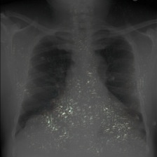
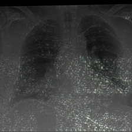

# Attack-agnostic Adversarial Detection on Medical Data Using Explainable Machine Learning

This repository contains the code used for all experiments in the paper Attack-agnostic Adversarial Detection on Medical Data Using Explainable Machine Learning, M Watson and N Al Moubayed, submitted to ICPR 2020.

## SHAP value heatmaps

These images are further examples to those shown in Figure 3. They are random samples from the MIMIC-CXR dataset, their PGD peturbation and the SHAP values of our Densenet121 classification model have been overlayed ontop of each image.

| Normal Sample                  | PGD Perturbed Sample          | C&W Perturbed samples        |
|--------------------------------|-------------------------------| -----------------------------|
|  |  |  |
|  |  |  |
|  |  |  |
|  |  |  |
|  |  |  |
|  |  |  |
|  |  |  |
|  |  |  |

## Code structure

- `requirements.txt` lists all required modules (can be installed via `pip`)
- `vae.py`, `ae.py`, `vae-with-svm.py` and `ae-with-svm.py` contain the code for our (V)AE adversarial detection methods
- `conv.py` and `mlp.py` contain the code for our CNN and MLP based adversarial detection methods
- `ShapDataset.py` allows these detection methods to be easily used with SHAP values
- See the [original LAVA repository](https://github.com/ast0414/lava) for details on the model and attacks used with EHR data
- `cxr_attack.py` contains code to generate adversarial samples from MIMIC-CXR data
- Supporting code for MIMIC-CXR can be found in the [official repository](https://github.com/MIT-LCP/mimic-cxr) from the dataset's authors

## Acknowledgements

For the RETAIN model used with the Henan-Renmin and MIMIC-III datasets is from the paper:

E.Choi,M.T.Bahadori,J.Sun,J.Kulas,A.Schuetz,andW.F.Stewart, “RETAIN: an interpretable predictive model for healthcare using reverse time attention mechanism,” in Advances in Neural Information Process- ing Systems 29: Annual Conference on Neural Information Processing Systems 2016, December 5-10, 2016, Barcelona, Spain, 2016, pp. 3504– 3512.

For adversarial attacks on EHR data, we use the [author's implementation](https://github.com/ast0414/lava) of LAVA and RETAIN.

The following datasets were used in the study:

- MIMIC-III: A. E. Johnson, T. J. Pollard, L. Shen, L.-w. H. Lehman, M. Feng, M. Ghassemi, B. Moody, P. Szolovits, L. Anthony Celi, and R. G. Mark, “MIMIC-III, a freely accessible critical care database,” Scientific Data, vol. 3, no. 1, p. 160035, May 2016.
- MIMIC-CXR: A.E.W.Johnson,T.J.Pollard,S.J.Berkowitz,N.R.Greenbaum,M.P. Lungren, C.-y. Deng, R. G. Mark, and S. Horng, “MIMIC-CXR, a de- identified publicly available database of chest radiographs with free-text reports,” Scientific Data, vol. 6, no. 1, p. 317, Dec. 2019.
- Henan-Renmin: [http://pinfish.cs.usm.edu/dnn/](http://pinfish.cs.usm.edu/dnn/)

Experiments on ML-LOO were carried out using the [author's implementation](https://github.com/Jianbo-Lab/ML-LOO).