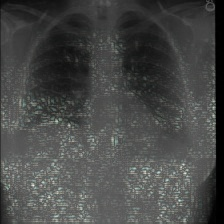
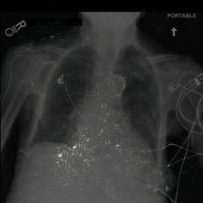
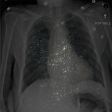
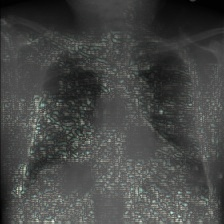
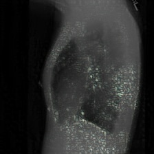
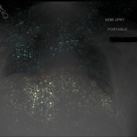

# Attack-agnostic Adversarial Detection on Medical Data Using Explainable Machine Learning

This repository contains the code used for all experiments in the paper Attack-agnostic Adversarial Detection on Medical Data Using Explainable Machine Learning, M Watson and N Al Moubayed, submitted to ICPR 2020.

## SHAP Value heat maps

These images are further examples to those shown in Figure 3. They are random samples from the MIMIC-CXR dataset, their PGD peturbation and the SHAP values of our Densenet121 classification model have been overlayed ontop of each image.

| Normal Sample                  | PGD Perturbed Sample          |
|--------------------------------|-------------------------------|
|  |  |
|  |  |
|  |  |
|  |  |
|  |  |
|  |  |
|  |  |
|  |  |
|  |  |
|  |  |